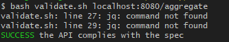

# CHALLENGE
Talkdesk's challenge application

Hello,
after spent few hours on this projectm here it's, the best that I could, hope it's good enaough to you guys.

I'm excited to hear you feedback.

I didn't get my application running on Heroku, instead I deployed on Digital Ocean
http://138.68.166.219:8090/swagger-ui.html
on this page you may teste my implementation

And I'm also provinding it using docker/docker-compose to run locally, 
to on localhost, just execute: docker-compose up

And after running validate.sh pointing to my application I get:

